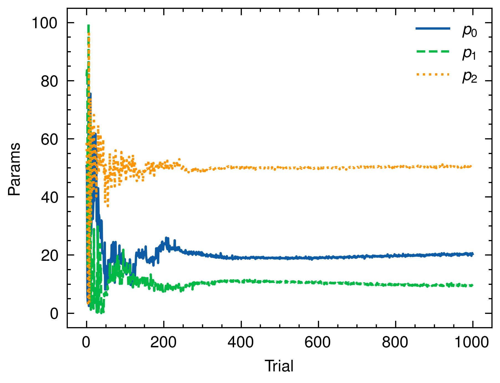

# TPE Optimization Example

This project demonstrates the usage of the `tpe` crate in Rust for optimization using the Tree-structured Parzen Estimator (TPE) algorithm. The example optimizes a simple objective function with one continuous and one categorical variable.

## Dependencies

- `tpe` crate for TPE optimization
- `peroxide` crate for plotting
- `rand` crate for random number generation

## Usage

1. Clone the repository and navigate to the project directory.
2. Run the example using `cargo run`.
3. The best parameters, trial, and value will be printed to the console.
4. Two plots will be generated:
   - `optimize_history.png`: Shows the objective value over trials, with the best value highlighted in red.
   - `parameter_history.png`: Shows the history of the continuous and categorical variables over trials.

## Results

The optimization results are shown in the following plots:

### Objective Value History


This plot shows the objective value for each trial. The best value found during the optimization is highlighted in red.

### Parameter History



This plot shows the history of the continuous variable (x) and the categorical variable (y) over the trials. The continuous variable is plotted as a line, while the categorical variable is plotted as scattered points.

## Objective Function

The objective function being optimized is a simple quadratic function with an additional term based on the categorical variable:

```rust
fn objective(x: f64, y: i32) -> f64 {
    x.powi(2) + y as f64
}
```

The goal is to minimize this objective function using the TPE algorithm.

## License

This project is licensed under the [MIT License](LICENSE).
