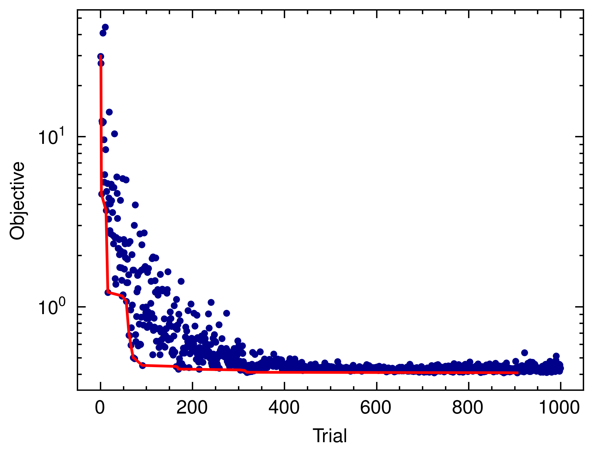

# TPE Tutorial in Rust

This project demonstrates how to perform parameter optimization using the Tree-structured Parzen Estimator (TPE) algorithm in Rust.
It compares the performance of TPE with the Levenberg-Marquardt (LM) algorithm for fitting a model to noisy data.

## Overview

The main steps of the tutorial are:

1. Generate noisy data from a true model with known parameters.
2. Fit the model using the Levenberg-Marquardt algorithm.
3. Perform parameter optimization using TPE.
4. Compare the performance of LM and TPE.

## Dependencies

The project uses the following Rust libraries:

- `peroxide` for automatic differentiation and optimization.
- `rand` for random number generation.
- `tpe` for the TPE algorithm.
- `indicatif` for progress bar visualization.

For plot feature in `peroxide`, you need to install below python libraries:

- `matplotlib` for plotting
- `scienceplots` for nature style plots

## Results

The tutorial generates three plots to visualize the results:

1. `optimize_history.png`: Shows the objective function value over the optimization trials for TPE.



2. `parameter_history.png`: Displays the evolution of the model parameters during the TPE optimization.


3. `lm_tpe.png`: Compares the fitted models obtained by LM and TPE with the true model and noisy data.


## Usage

To run the tutorial, ensure you have Rust installed, then execute:

```bash
cargo run --release
```

The plots will be saved in the current directory.
